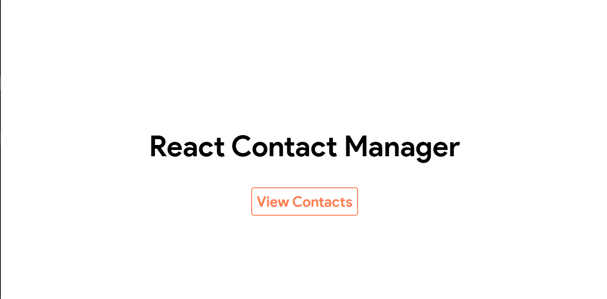

# React Contact Management 🌍(SPA)

Simple App for contact managing locally

# Features🪂:

1.  Know the Country languages.
2.  Know the Population of the Country.
3.  Know the surrounding Borders

## Hosted on Firebase(🔥):

# Getting started😉:

```
> git clone 'https://github.com/gtchakama/React-CM'
> cd app
> npm install
> npm start
```

# Screenshots📼:

## Homepage



# Tech Stack Used💡:

- React JS
- React Router
- Form Validation
- Semantic UI
- Styled Components
